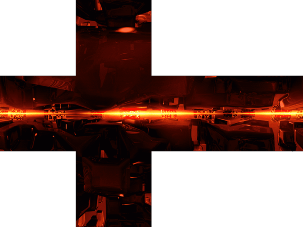

# Skybox Loader - dual input types

## USAGE

Function set includes 3 parts:
1. loadSkyBox = (size, pwr, url, type='box')
  returns an object (array) with the skybox guts, based on provided params
  'pwr' is a power of 2 for the output resolution. danger! pwr > 5 may cause severe performance issues / browser hang
  'url' is a link to the resource file, may be of either type shown above
  'type' is either 'box' (default/blank), or 'HDRI', case sensitive

3. loadSkyBoxes = (res = 6, size=1e3)
   function used by this demo: loads the local resources for display in a loop.
   could be useful in other projects, as a springboard
   
5. drawSkyBox = ()
   draws the skybox specified

## Note
  * global: 'skyboxesLoaded' set to 'true' when all skybox resources have been loaded
  * global: 'skyboxSel' determines which skybox is drawn via 'drawSkyBox()',
    corresponding to the order in which they were loaded (code-wise, not race-condition wise :P)

### online demo [general purpose skybox loader](https://srmcgann.github.io/TRON2.0)
